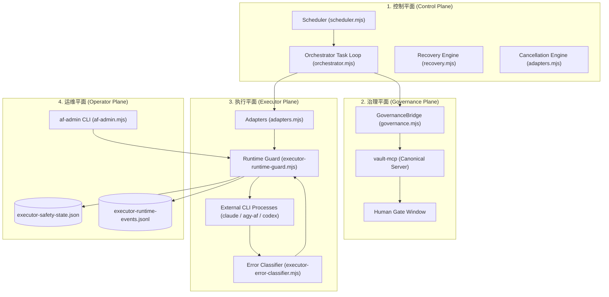

# Agent Foundry Orchestrator — Final Architecture Specification (PHASE 1 - 5 Freeze)

**Frozen Baseline Date:** 2026-09-06  
**Status:** ARCHITECTURE FROZEN  
**Target Directory:** `/mnt/c/Users/relaret/agent-foundry-orchestrator/`  

---

## 1. 核心治理红线与架构不变量 (Architectural Invariants)

1. **`ROLE != PLATFORM`**  
   平台仅为 Executor（Codex / Claude / Antigravity 等）；`author` / `reviewer` / `fix` / `verifier` 为任务动态角色。严禁在代码或配置中静态绑定平台与角色。
2. **单一真相源物理隔离 (Separation of Single Sources of Truth)**  
   - **Capability Truth**: 静态能力审计唯一真源为 `agent-foundry-global/executors/*.json`。
   - **Availability Truth**: 环境可用性投影唯一真源为 `lib/executor-status.mjs`。
   - **Governance Truth**: 知识库治理唯一真源为 `vault-mcp`。
   - **Runtime Safety State**: 运行时动态观测唯一真源为 `runtime/executor-safety-state.json`。
   严禁创建第二注册表、影子能力库或第二治理平面。
3. **零外部重依赖**  
   不引入外部数据库（PostgreSQL/MySQL/Redis）、不引入独立 Daemon 守护进程、不引入 Web UI，全面采用原子文件持久化（Atomic File Store）与标准 POSIX/OS 进程管理。

---

## 2. 总体架构分层 (Four-Plane Architecture)



---

## 3. 控制平面 (Control Plane)

### 3.1 任务生命周期状态机 (Task Lifecycle)
系统支持严格受控的状态流转：
```text
CREATED 
  ↓
AUTHOR_RUNNING 
  ↓
REVIEW_RUNNING 
  ↓ (decision: NEEDS_FIX) → AUTHOR_RUNNING (exact resume)
  ↓ (decision: PASS)
[Acceptance Gate] → (failed) → AUTHOR_RUNNING (fix loop, bounded by max_revisions)
  ↓ (passed)
[Task Mode Branch]
  ├── workspace mode   → COMPLETED
  └── governed_write   → GOVERNANCE_PENDING 
                            ↓
                          [Policy Evaluator]
                            ├── auto_publish   → PUBLISHING → COMPLETED
                            ├── human_required → WAITING_HUMAN → [resume] → COMPLETED
                            └── deny           → FAILED (GOVERNANCE_DENIED)
```
终态集合：`COMPLETED`, `FAILED`, `CANCELLED`。

### 3.2 任务调度器 (`lib/scheduler.mjs`)
- **有界并发与任务隔离**：通过 `maxConcurrent` 控制全局并发任务数，任务间通过基于 PID 的排他任务锁（`locks/<task_id>.lock`）防止重入。
- **预检机制 (`#preflight`)**：在调度任务前校验可用性真相（`availability_status !== UNAVAILABLE`）与运行时熔断状态（`runtimeGuard.canExecute(id)`）。若拦截，直接将任务标记为任务级失败（`retryable: false`），不消耗重试预算，不调用底层执行器。
- **错误语义纯消费者**：调度器完全移除非法的正则表达式错误文本匹配，仅消费底层透传的 `task.retryable === true` 决定是否进行有限重试（`maxExecutorRetries`）。

### 3.3 灾后恢复与幂等性 (`lib/recovery.mjs`)
- **恢复分类判定**：
  - `RESUMABLE`：中断在 author/review/fix 阶段，利用持久化的 `author_session_ref` 执行精准断点恢复（Exact Resume）。
  - `WAITING_EXTERNAL`：处于 `WAITING_HUMAN` 的治理任务保持静止挂起，绝不重新拉起模型。
  - `TERMINAL`：已达终态任务保持终态，严禁重跑。
- **版本碰撞与防双写**：利用 `state_version` 保护，恢复计划若发现磁盘任务版本推进，立即终止放弃覆盖；重复恢复保证幂等。

### 3.4 精准取消机制 (`terminateRun` in `lib/adapters.mjs`)
- **唯一运行标识 (`executor_run_id`)**：取消指令精准定位目标运行，而非模糊终止“最新进程”。
- **PID 重用保护**：通过检查 `/proc/<pid>/cmdline` 验证进程启动特征（`claude`, `agy`, `codex`），若不符报错 `CANCEL_TARGET_NOT_CONFIRMED`，严禁盲目 kill。
- **两阶段信号终止**：先发送 `SIGTERM` 并给予 Grace Period（默认 4s）；超时未退出则升级为 `SIGKILL`。

---

## 4. 治理平面 (Governance Plane)

### 4.1 `vault-mcp` 唯一真相源
- Orchestrator 自身**不实现**知识库规则解析、评分模型、候选发布和写回逻辑。
- 所有治理相关语义全部委托由 `agent-foundry-vault` 官方 MCP 服务处理，编排器仅保留带有 `governance_source: "vault-mcp"` 的观察镜像。

### 4.2 候选与评审流水线
- **Candidate 生成**：调用 `write_candidate`，将 author 提交的草稿写入收件箱并生成唯一 `candidate_id`。
- **独立评审员审查**：调用 `review_candidate`，强制要求 `author_agent_instance_id != reviewer_agent_instance_id`，独立评审员给出 `approve` 或 `reject` 裁决。
- **Policy 决策**：由治理平面自动评定等级：
  - `auto_publish`：无红线风险的 L2 变更，自动进入 `publish_candidate`。
  - `human_required`：涉及 L3 或高风险变更，任务状态迁移至 `WAITING_HUMAN` 并释放调度槽位。
  - `deny`：违反治理政策，直接置任务为 `FAILED`，不可降级重试。
- **目标协调租约 (`TargetCoordinator`)**：同一文件路径（Target）在同一时间仅允许一个活跃写任务，彻底避免多任务竞态覆盖。

---

## 5. 执行平面 (Executor Plane)

### 5.1 三权分立模型 (The Separation of Concerns)
1. **Capability (静态能力真相)**：`agent-foundry-global/executors/*.json`。只读事实，定义 CLI 是否支持非交互式 `--print`、结构化 `--json-schema`、MCP 等。
2. **Availability (系统可用性真相)**：`lib/executor-status.mjs`。只读投影，依据 `blockers` 识别当前是否因 ToS 封号或缺少关键组件处于不可用状态。
3. **Runtime Safety (运行时安全守卫)**：`lib/executor-runtime-guard.mjs`。动态管控，维护进程并发硬上限、启动起搏节流与熔断状态机。

### 5.2 错误分类与安全执行链
执行调用链：
`Adapter -> Runtime Guard (acquireSlot) -> OS Subprocess -> Error Classifier -> Runtime Guard (recordResult) -> Orchestrator`
- **错误分类器 (`lib/executor-error-classifier.mjs`)**：
  - `ACCOUNT_POLICY` (403/TOS) → `retryable: false`, `safety_action: OPEN_MANUAL_RESET`
  - `RATE_LIMIT` (429) → `retryable: false`, `safety_action: COOLDOWN`
  - `AUTH_FAILURE` (401) → `retryable: false`, `safety_action: OPEN_MANUAL_RESET`
  - `ENVIRONMENT_FAULT` → `retryable: false`, `safety_action: NONE`
  - `TRANSIENT_FAULT` (超时/进程 crash) → `retryable: true`, `safety_action: NONE`

---

## 6. 运维平面 (Operator Plane)

### 6.1 `af-admin` CLI
系统提供全局命令行工具 `/home/relaret/bin/af-admin`：
- `af-admin executor status [executor]`：跨层聚合输出特定执行器的能力、可用性、运行时及熔断现状。
- `af-admin circuit list`：精简列出当前所有执行器的熔断状态。
- `af-admin circuit reset <executor> --reason "<text>"`：手动解除熔断，强制要求输入审核理由，禁止自动化静默重置。

### 6.2 运行时审计日志 (`runtime/executor-runtime-events.jsonl`)
- 追加记录关键安全事件：
  - `CIRCUIT_OPEN`：记录触发熔断的执行器、分类原因与时间。
  - `LAUNCH_BLOCKED`：记录因熔断阻断的发射尝试。
  - `CIRCUIT_RESET`：记录操作员姓名、重置理由与时间。
- **数据合规硬边界**：底座强制执行属性过滤，绝不记录 Prompt、Model Output、Token 与 API 凭据。

---

## 7. 架构冻结结论 (Freeze Confirmation)

本架构经由 PHASE 1 至 PHASE 5-C 完整实施与真实宿主压力验证，50 项自动化测试全量通过，正式进入维护冻结状态。
