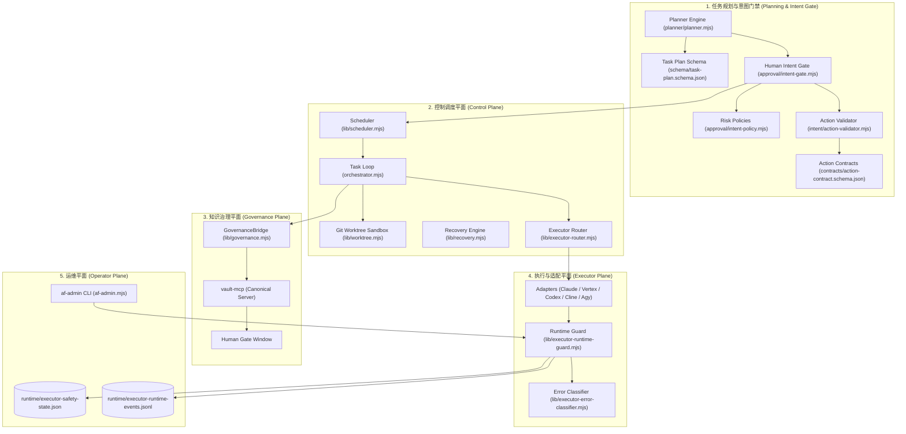

# Agent Foundry Orchestrator — Architecture Specification (Full Stack v1.2)

> **当前架构版本：** Production Release v1.2 (Full Capabilities Baseline)  
> **自动化测试状态：** **171 / 171 PASS (100%)**  
> **设计核心：** 零外部数据库、零常驻守护进程、纯文件系统原子持久化、环境自适应无硬编码路径。

---

## 1. 核心治理红线与架构不变量 (Architectural Invariants)

1. **`ROLE != PLATFORM`**  
   平台仅为底层 Executor（Claude / Vertex Gemini / Codex / Cline / Antigravity）；`author` / `reviewer` / `worker` / `verifier` / `planner` 为任务动态角色。严禁将平台与任务角色进行任何静态硬编码绑定。
2. **单一真相源物理隔离 (Separation of Single Sources of Truth)**  
   - **Capability Truth**: 静态能力审计唯一真源为 `agent-foundry-global/executors/*.json`。
   - **Availability Truth**: 环境可用性投影唯一真源为 `lib/executor-status.mjs`。
   - **Governance Truth**: 长期知识库治理唯一真源为 `vault-mcp`。
   - **Runtime Safety State**: 运行时动态观测唯一真源为 `runtime/executor-safety-state.json`。
   - **Action Contracts**: 动作白名单唯一真源为 `contracts/action-types.json`。
   严禁创建第二注册表、影子能力库或第二治理平面。
3. **零外部重依赖与全平台可移植性**  
   - 绝不引入外部数据库（PostgreSQL/MySQL/Redis）、不引入独立 Daemon 守护进程、不暴露非受控 Web UI。
   - 全面采用原子文件持久化（Atomic File Store）与标准 POSIX/OS 进程管理。
   - **零硬编码主机路径**：全工程通过 `lib/config.mjs` 统一解析环境变量（`AF_GLOBAL_DIR`, `AF_VAULT_MCP_SERVER`）并自动推导当前宿主 `$HOME`，保证跨机开箱即跑。

---

## 2. 总体架构分层 (Extended Plane Architecture)

---

## 3. 规划与意图门禁系统 (Planning & Intent Gate)

### 3.1 任务规划层 (`planner/`)
- **自动拆解复杂目标**：当任务包含复杂步骤时，Planner 将其拆解为满足 `schema/task-plan.schema.json` 的步骤 DAG（Directed Acyclic Graph）。
- **拓扑分批 (Batching)**：`buildPlanBatches` 分析步骤间依赖，将无数据竞争的步骤归入并行批次，有前置依赖的步骤归入后续批次，且严格检测并阻断循环依赖。
- **架构边界红线**：Planner 仅负责拆解步骤目标、角色（`author`/`worker`/`verifier`）与执行参数，**严禁分配或直接调用特定 Executor 平台**。

### 3.2 人类意图门禁 (`approval/` + `intent/`)
- **高危操作主动拦截**：
  - 架构规则或 SCHEMA 变更；
  - 知识库与全局治理核心配置修改；
  - 大量或不可逆代码删除操作；
  - Planner 目标方向的重大漂移。
- **阻断行为**：一旦触发高危规则，任务状态直接置为 `WAITING_HUMAN`，并在 `approval/` 下生成待审意图凭证，等待操作员显式确认或撤销。
- **动作合约校验 (`contracts/`)**：校验入参载荷，禁止非合约声明的越权行为。

---

## 4. 控制调度平面 (Control Plane)

### 4.1 并行 Git Worktree 隔离与合并 (`lib/worktree.mjs`)
- **分支级隔离执行**：并发批次中的任务各自分配一个专属的 Git 临时工作树目录（`worktree/<step_id>`）和隔离分支，避免同一工作区内的文件覆盖与并发读写冲突。
- **原子合流与冲突闭锁**：各子步骤完成后，调度器依次将工作树分支 Merge 回主分支。若发生代码冲突（Git Merge Conflict），系统触发 Fail-Closed，中止后续批次并记录 `MERGE_CONFLICT` 证据，杜绝静默强推覆盖。

### 4.2 任务双模型博弈循环 (`orchestrator.mjs` + `lib/scheduler.mjs`)
- **Author -> Reviewer -> Acceptance**：创作者产出代码，由独立 Reviewer 审核；若为 `NEEDS_FIX`，通过精确会话恢复（Exact Resume）接续原 Author 会话修改。
- **确定性白名单验收**：测试命令仅来源于任务定义静态声明，执行前经过严格校验，严禁执行大模型输出的任意未知 Shell 命令。
- **重试上限保护**：单任务设置有限重试次数（`max_revisions`，默认 3 次），消耗殆尽转为 `FAILED`。

### 4.3 容灾接续与幂等恢复 (`lib/recovery.mjs`)
- **只读扫描分析**：`node orchestrator.mjs recover --scan` 无副作用检测中断任务。
- **孤儿锁自动接管**：精准检测崩溃遗留锁的 PID 存活性（`process.kill(pid, 0)`），对 Dead PID 执行审计打标后安全抢占接管。
- **会话断点接续**：根据已持久化的 `runs` 记录重构现场，不重跑已确认的阶段。

---

## 5. 治理平面 (Governance Plane)

- **`vault-mcp` 唯一真源**：编排器自身不实现知识库规则、发布策略与打分模型。
- **受控桥接 (`lib/governance.mjs`)**：受治理任务通过 MCP 协议生成 candidate 并触发 Policy 仲裁：
  - `auto_publish` (L2 变更) 允许自动发布；
  - `human_required` (L3 变更) 强制进入 `WAITING_HUMAN` 门禁；
  - `deny` 直接 Fail-Closed 终止。

---

## 6. 执行与路由平面 (Executor & Router Plane)

### 6.1 纯函数确定性路由器 (`lib/executor-router.mjs`)
- 按照四步漏斗进行筛选：
  1. **Capability Filter**（过滤不支持 MCP、缺少必要环境的执行器）；
  2. **Availability Filter**（过滤被系统静态阻断的执行器）；
  3. **Runtime Safety Filter**（过滤处于熔断或冷却期的执行器）；
  4. **Priority Sort**（按全局策略给出 primary 与 fallbacks 列表）。

### 6.2 执行器安全守卫 (`lib/executor-runtime-guard.mjs`)
- **错误分类器 (`lib/executor-error-classifier.mjs`)**：
  - `ACCOUNT_POLICY` (403/TOS) → 零重试、零 Fallback，立即闭锁为 `OPEN_MANUAL_RESET`；
  - `RATE_LIMIT` (429) → 指数退避冷却 `OPEN_COOLDOWN`；
  - `TRANSIENT_FAULT` → 允许调度器重试或降级到备选执行器。
- **受控准入 (Gated Recovery)**：人工通过 `af-admin` 执行沙箱轻量探活（Probe），产生 `probe_evidence_id` 后经显式 Admit 方可恢复闭环。

---

## 7. 跨平台环境自适应发现 (`lib/config.mjs`)

为彻底根治工程在不同开发机上的路径写死问题，引入统一配置发现层：

| 发现项 | 环境变量 (优先) | 相对定位 (次选) | 动态保底 (兜底) |
| :--- | :--- | :--- | :--- |
| **Global 规范目录** | `AF_GLOBAL_DIR` | `../agent-foundry-global` | `$HOME/agent-foundry-global` |
| **Vault MCP 服务** | `AF_VAULT_MCP_SERVER` | `../vault-mcp/server.mjs` | `$HOME/vault-mcp/server.mjs` |
| **Node 二进制路径** | - | `dirname(process.execPath)` | 当前运行中的 Node 环境 |
| **用户配置路径** | `CODEX_CONFIG_PATH` 等 | - | `$HOME/.codex/config.toml` 等 |

---

## 8. 自动化测试套件矩阵 (171 Tests All Green)

| 测试模块 | 用例数 | 覆盖核心保障 |
| :--- | :---: | :--- |
| `tests/worktree-orchestrator.test.mjs` | 2 | 多步骤 DAG 并行 Worktree 执行、合并冲突安全闭锁 |
| `tests/worktree.test.mjs` | 5 | Git Worktree 独立分支创建、并发写入合并、拓扑分批成环检测 |
| `tests/planner-layer.test.mjs` | 6 | Planner 目标拆解、Plan Schema 校验、执行器解耦边界 |
| `tests/human-intent-gate.test.mjs` | 9 | 高危动作与敏感资产拦截、人类批准继续、驳回取消、不可调用执行器 |
| `tests/action-contract.test.mjs` | 8 | Action Contract 合约校验、白名单拦截 |
| `tests/action-contract-hardening.test.mjs` | 12 | 合约格式加固、极端异常参数防御、分类结果与 CWD 无关 |
| `tests/production-readiness.test.mjs` | 5 | 异常崩溃恢复、403 强闭锁、SIGTERM 优雅停机、状态损坏检测、双实例互斥锁 |
| `tests/architecture-invariant.test.mjs` | 5 | 单注册表检验、单调度器检验、防凭证泄露、防治理绕过（仅 published 才算发布）、ROLE != PLATFORM |
| `tests/shutdown.test.mjs` | 4 | SIGTERM 进程树自动回收、孤儿句柄消除 |
| `tests/enterprise-adapter.test.mjs` | 5 | Vertex Gemini 企业适配器接口一致性与角色解耦（stub launcher） |
| `tests/cline-adapter.test.mjs` | 8 | Cline 适配器接口规范、DeepSeek 推理等级参数、日志 429 穿透防误报 |
| `tests/gated-recovery.test.mjs` | 8 | 熔断探活 (Probe)、伪造证据拦截、准入 (Admit) 恢复机制 |
| `tests/executor-router.test.mjs` | 8 | 纯函数确定性路由漏斗与透明降级 |
| `tests/executor-ops.test.mjs` | 5 | 运维状态查询、熔断器列表、审计证据持久化 |
| `tests/operator-maintenance.test.mjs` | 6 | 历史任务修剪 (Prune)、日志轮转 (Rotate)、冷却状态投影 |
| `tests/runtime-safety.test.mjs` | 7 | 并发槽位限制、防并发打崩、死循环检测、熔断跨执行器隔离 |
| `tests/cancellation.test.mjs` | 3 | 精确 runId 进程终止、任务取消隔离 |
| `tests/cancellation-real-adapters.test.mjs` | 4 | codex/claude/antigravity 真实适配器取消证据、取消粘滞不可覆盖 |
| `tests/concurrency.test.mjs` | 9 | 并行任务状态与会话隔离、stale 锁抢占 |
| `tests/governance.test.mjs` | 11 | L2 自动发布、L3 人工门禁、拒绝不可降级、策略类别不等于发布结果 |
| `tests/hardening.test.mjs` | 7 | 验收命令白名单加固、任务文件原子写 |
| `tests/recovery.test.mjs` | 11 | 断点接续精准度、死锁安全回收、幂等恢复 |
| `tests/conversation-gateway.test.mjs` | 6 | MCP Gateway 接口接入与任务派发（自带夹具） |
| `tests/executor-error-classifier.test.mjs` | 7 | stdout/stderr 403 与 TOS 一律 fail-closed、测试日志 403 不误报 |
| `tests/acceptance-allowlist.test.mjs` | 6 | 验收白名单、信任锚防篡改、子进程 env 净化、工作区隔离 |
| `tests/runtime-guard-state.test.mjs` | 4 | 熔断状态原子写、损坏 fail-closed、纯读查询、冷却投影 |
| **总计** | **171** | **100% PASS** |
